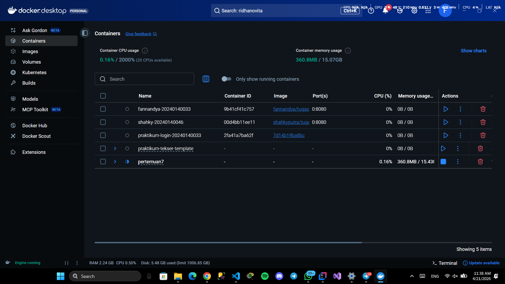
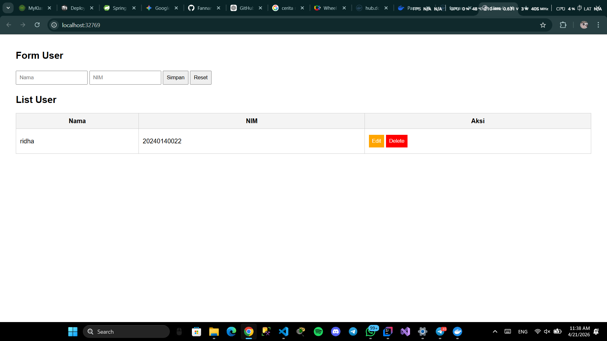
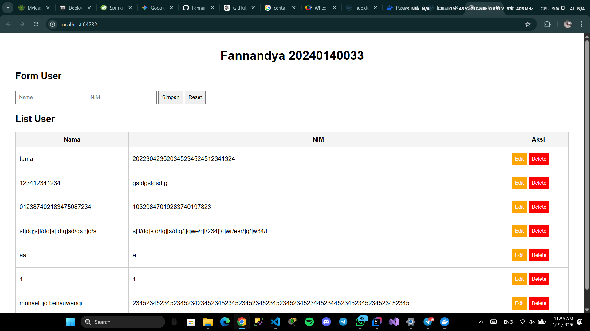

# Laporan Praktikum 7 - Deployment & Docker
**Nama:** Fannandya Sutan Sakti Pratama  
**NIM:** 20240140033  
**Kelas:** D  
**Mata Kuliah:** Deployment

---

## 1. Bukti Docker Desktop
Bagian ini berisi screenshot setelah proses push image ke Docker Hub dan pull image dari teman.

| Keterangan | Gambar                                |
| :--- |:--------------------------------------|
| **Image Docker Desktop** |       |
| **Container Docker Desktop** |  |

---

## 3. Website Teman (Pull & Run)
Bukti saya berhasil melakukan pull dan menjalankan image milik teman.

| Fitur                        | Screenshot                      |
|:-----------------------------|:--------------------------------|
| **Homepage Ridha**           |     |
| **Homepage Pribadi**         |  |
---

